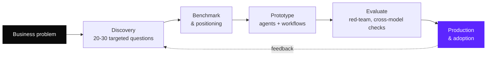

<picture>
  <source media="(prefers-color-scheme: dark)" srcset="./header-dark.svg">
  
</picture>

<p align="left">
  <a href="https://waelgharbi.com"></a>
  <a href="https://linkedin.com/in/gharbiwael"></a>
  
  
</p>

I design and ship AI products: agentic systems, SaaS platforms and automated workflows, taken from a business problem all the way to production. My background mixes product, engineering, consulting and media, which is why I care as much about adoption and data value as about the model itself.

```yaml
role:      Responsable Produit & Innovation @ Korbyx (AI consulting & product, Paris)
focus:     agentic systems (MCP, RAG, multi-agent), no-code builders, AI for SMEs
also:      AI reliability & evaluation, data value inside companies
languages: Arabic (native) · French (C2) · English (C1) · Turkish (B2)
```

---

### What I build

| | Area | In practice |
|:-:|---|---|
| 🧠 | **Agentic systems** | MCP servers and connectors, RAG pipelines, multi-agent orchestration (AutoGen) |
| 🧩 | **AI products & SaaS** | Discovery, positioning, roadmap, specs, then shipping with Next.js / Supabase |
| ⚙️ | **Automation** | Self-hosted n8n in production (Railway, Postgres), business workflows end to end |
| 📊 | **Data to decisions** | Turning data a company already owns into decision support, without new hardware |
| 🔍 | **Market & strategy** | Competitive benchmarks (100+ players), go-to-market, private LLM deployment theses |

---

### How I work



---

### Featured work

<details open>
<summary><b>Korbyx</b>, augmented consulting and product platform for SMEs</summary>
<br>

- **Phase 1, Augmented consulting**: continuous strategic advisory for SMEs, powered by AI. Positioning built on a benchmark of 100+ competitors across 9 categories, and a thesis on private LLMs and conversational data under the EU Data Governance Act.
- **Phase 2, Builder**: a no-code builder for business apps, "where data becomes decisions". Connector architecture: MCP first, then Chift for French SaaS, Merge / Nango for write actions, Airbyte for analytics ingestion.
- **Franchise network platform**: a product that helps franchisors animate and steer their networks.
- **AI for sports clubs**: exploiting data a football or rugby club already owns, performance first, no capture hardware.
</details>

<details>
<summary><b>Autogenstudio</b>, a virtual marketing agency run by LLM agents</summary>
<br>

Multi-agent setup on AutoGen Studio where specialised agents (creative, data analysis, web research, content, image generation, scrapers) collaborate only when a task needs them. Skills include scraping (Selenium, BeautifulSoup), Google Trends, YouTube transcripts, sentiment analysis, PDF extraction and front-end generation. Models are routed by cost: GPT-4o mini for routine work, Mistral for research, DALL-E 3 for visuals.

[`→ repo`](https://github.com/GharbiW/Autogenstudio) · [`→ AutoGen v0.4 notebooks`](https://github.com/GharbiW/AutoGenv0.4)
</details>

<details>
<summary><b>Novea</b>, fan engagement and virtual museum for a football club</summary>
<br>

Next.js 14 + TypeScript demo for a fictional club: a virtual museum (4 rooms, 24+ exhibits), daily challenges, fan points, streaks, badges and leaderboards. Offline-first, no account, no personal data, a local rule-based AI engine with an optional OpenAI upgrade, and a repository layer ready for a database swap.

[`→ repo`](https://github.com/GharbiW/novea)
</details>

<details>
<summary><b>Automation & generative AI</b>, n8n and Stable Diffusion</summary>
<br>

Production n8n workflows (self-hosted on Railway with Postgres) and experiments with image generation pipelines.

[`→ n8n`](https://github.com/GharbiW/n8n) · [`→ StableDiffusion`](https://github.com/GharbiW/StableDiffusion)
</details>

<details>
<summary><b>Research</b>, data value, AI reliability, demarketing</summary>
<br>

- Master's thesis (M2, Université Paris-Saclay) on the value of companies' internal data.
- Work on AI reliability and evaluation.
- A 2026 update of my demarketing research, now connected to AI.
</details>

---

### Path

<details>
<summary><b>Experience timeline</b> (click to expand)</summary>
<br>

| Period | Role | Where |
|---|---|---|
| 09/2025 → now | **Responsable Produit & Innovation** | Korbyx, Paris |
| 03/2025 → 03/2026 | **Chef de Projet IA & Growth** | DOMetVIE |
| 03/2022 → 09/2025 | **Lead Innovation & Technologie** | Dolphx |
| 03/2018 → 02/2022 | **Founder & Editor-in-Chief** | Lesportif Magazine, Sousse |

Earlier and alongside: recruitment, media (Knooz FM), e-commerce (LadyBio) and logistics (route optimisation for Parnass Transport).

**Education**: Master 2, Innovation, Digital et Conseil, Université Paris-Saclay.
</details>

---

### Toolbox

<p>
  
  
  
  
  
  
  
  <br>
  
  
  
  
  
  
  
</p>

---

### Activity

<picture>
  <source media="(prefers-color-scheme: dark)" srcset="https://github-readme-activity-graph.vercel.app/graph?username=GharbiW&bg_color=0D1117&color=A0A0A0&line=5C26FF&point=FFFFFF&area=true&area_color=5C26FF&hide_border=true">
  
</picture>

---

<p align="center">
  <sub>Want to talk about an AI product, an agentic workflow or data in your company? <a href="https://waelgharbi.com">waelgharbi.com</a> · <a href="https://linkedin.com/in/gharbiwael">LinkedIn</a></sub>
</p>
