<a href="https://waelgharbi.com"><picture><source media="(prefers-color-scheme: dark)" srcset="./hero-dark.svg"></picture></a>

  
  
  

<picture><source media="(prefers-color-scheme: dark)" srcset="./stats-dark.svg"></picture>
  
<picture><source media="(prefers-color-scheme: dark)" srcset="./s1-dark.svg"></picture>

<picture><source media="(prefers-color-scheme: dark)" srcset="./x1-dark.svg"></picture>&nbsp;<picture><source media="(prefers-color-scheme: dark)" srcset="./x2-dark.svg"></picture>

<picture><source media="(prefers-color-scheme: dark)" srcset="./x3-dark.svg"></picture>&nbsp;<picture><source media="(prefers-color-scheme: dark)" srcset="./x4-dark.svg"></picture>

 
<picture><source media="(prefers-color-scheme: dark)" srcset="./s2-dark.svg"></picture>

<picture><source media="(prefers-color-scheme: dark)" srcset="./timeline-dark.svg"></picture>

<b>&nbsp;Korbyx</b> · Responsable Produit & Innovation · <i>09/2025 → now</i>

 

- Product owner of the augmented consulting platform: continuous, AI-powered strategic advisory for SMEs.
- Framing **Builder**, a no-code business app builder. Connector architecture: MCP first, Chift for French SaaS, Merge / Nango for write actions, Airbyte for analytics.
- Product discovery on a franchise network platform and on AI for sports clubs.
- Competitive benchmark of 100+ players across 9 categories, positioning and go-to-market.

<b>&nbsp;DOMetVIE</b> · Chef de Projet IA & Growth · <i>03/2025 → 03/2026</i>

 

- AI projects and growth initiatives.

<b>&nbsp;Dolphx</b> · Lead Innovation & Technologie · <i>03/2022 → 09/2025</i>

 

- AI products, automation and digital transformation for clients.

<b>&nbsp;Lesportif Magazine</b> · Founder & Editor-in-Chief · <i>03/2018 → 02/2022</i>

 

- Founded and ran a digital sports media outlet in Sousse.

<b>&nbsp;Earlier</b> · media, e-commerce, logistics, recruitment

 

- Knooz FM (media), LadyBio (e-commerce), route optimisation for Parnass Transport (logistics), recruitment.
- Master 2, Innovation, Digital et Conseil, Université Paris-Saclay.

 
<picture><source media="(prefers-color-scheme: dark)" srcset="./s3-dark.svg"></picture>

<a href="https://github.com/GharbiW/Autogenstudio"><picture><source media="(prefers-color-scheme: dark)" srcset="./p1-dark.svg"></picture></a>&nbsp;<a href="https://github.com/GharbiW/novea"><picture><source media="(prefers-color-scheme: dark)" srcset="./p2-dark.svg"></picture></a>

<a href="https://waelgharbi.com"><picture><source media="(prefers-color-scheme: dark)" srcset="./p3-dark.svg"></picture></a>&nbsp;<a href="https://waelgharbi.com"><picture><source media="(prefers-color-scheme: dark)" srcset="./p4-dark.svg"></picture></a>

<a href="https://waelgharbi.com"><picture><source media="(prefers-color-scheme: dark)" srcset="./p5-dark.svg"></picture></a>&nbsp;<a href="https://waelgharbi.com"><picture><source media="(prefers-color-scheme: dark)" srcset="./p6-dark.svg"></picture></a>

 
<picture><source media="(prefers-color-scheme: dark)" srcset="./s4-dark.svg"></picture>

<picture><source media="(prefers-color-scheme: dark)" srcset="./stack-dark.svg"></picture>
  
<picture><source media="(prefers-color-scheme: dark)" srcset="./s5-dark.svg"></picture>

<picture><source media="(prefers-color-scheme: dark)" srcset="./r1-dark.svg"></picture>&nbsp;<picture><source media="(prefers-color-scheme: dark)" srcset="./r2-dark.svg"></picture>&nbsp;<picture><source media="(prefers-color-scheme: dark)" srcset="./r3-dark.svg"></picture>

 
<a href="https://waelgharbi.com"><picture><source media="(prefers-color-scheme: dark)" srcset="./footer-dark.svg"></picture></a>
