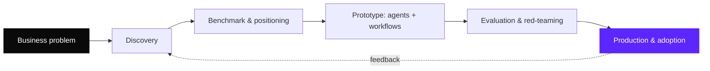

<picture>
  <source media="(prefers-color-scheme: dark)" srcset="./assets/header-dark.svg">
  
</picture>

 
 

  
  &nbsp;
  
  &nbsp;
  

 

  I design and ship <b>AI products</b>: agentic systems, SaaS platforms and automated workflows, 
  taken from a business problem all the way to production.

 

<table align="center">
  <tr>
    <td align="center" width="25%"><b>Now</b> Responsable Produit & Innovation Korbyx, Paris</td>
    <td align="center" width="25%"><b>Focus</b> Agentic systems MCP · RAG · multi-agent</td>
    <td align="center" width="25%"><b>Also</b> AI reliability & evaluation Data value in companies</td>
    <td align="center" width="25%"><b>Languages</b> Arabic · French C2 English C1 · Turkish B2</td>
  </tr>
</table>

 

## Expertise

 

| | Area | In practice |
|:-:|:--|:--|
| 🧠 | **Agentic systems** | MCP servers and connectors, RAG pipelines, multi-agent orchestration |
| 🧩 | **AI products & SaaS** | Discovery, positioning, roadmap, specs, delivery with Next.js and Supabase |
| ⚙️ | **Automation** | Self-hosted n8n in production, business workflows end to end |
| 📊 | **Data to decisions** | Turning data a company already owns into decision support |
| 🔍 | **Strategy & market** | Benchmarks of 100+ players, go-to-market, private LLM deployment |

 

## How I work

 

 

## Experience

 

<b>Responsable Produit & Innovation</b> · Korbyx · <i>09/2025 → now</i>

 

AI consulting and product firm for SMEs ("augmented consulting").

- Product owner of the augmented consulting platform: continuous AI-powered strategic advisory for SMEs.
- Shaping **Builder**, a no-code business app builder where data becomes decisions. Connector architecture: MCP first, Chift for French SaaS, Merge / Nango for write actions, Airbyte for analytics.
- Product work on a franchise network platform and on AI for sports clubs (performance data, no capture hardware).
- Competitive benchmark of 100+ players across 9 categories, positioning and go-to-market.

 

<b>Chef de Projet IA & Growth</b> · DOMetVIE · <i>03/2025 → 03/2026</i>

 

- AI projects and growth initiatives.

 

<b>Lead Innovation & Technologie</b> · Dolphx · <i>03/2022 → 09/2025</i>

 

- AI products, automation and digital transformation projects for clients.

 

<b>Founder & Editor-in-Chief</b> · Lesportif Magazine · <i>03/2018 → 02/2022</i>

 

- Founded and ran a digital sports media outlet in Sousse.

 

<b>Earlier</b> · media, e-commerce, logistics, recruitment

 

- Media: Knooz FM.
- E-commerce: LadyBio.
- Logistics: route optimisation for Parnass Transport.
- Recruitment.

 

 

## Selected work

 

### 🔒 Private & client work

 

| Project | Context | What I delivered |
|:--|:--|:--|
| **Augmented consulting platform** | SMEs, B2B SaaS | Product vision, roadmap, AI advisory flows |
| **No-code business app builder** | SMEs, B2B SaaS | Product framing, connector architecture |
| **Franchise network platform** | Franchisors | Product discovery and market analysis |
| **AI for sports clubs** | Pro football / rugby | Positioning on clubs' existing data |
| **Production automation stack** | Internal ops | n8n on Railway with Postgres, workflows in production |

 

### 🌐 Open source

 

<table>
  <tr>
    <td width="50%" valign="top">
      <b><a href="https://github.com/GharbiW/Autogenstudio">Autogenstudio</a></b> 
      A virtual marketing agency run by LLM agents (AutoGen Studio). Creative, research, data, content, image and scraping agents that only collaborate when the task needs it.  
      <code>Python</code> <code>AutoGen</code> <code>OpenAI</code> <code>Mistral</code>
    </td>
    <td width="50%" valign="top">
      <b><a href="https://github.com/GharbiW/novea">Novea</a></b> 
      Fan engagement app for a football club: virtual museum, daily challenges, points, badges and leaderboards. Offline-first, no personal data.  
      <code>Next.js</code> <code>TypeScript</code> <code>Tailwind</code> <code>shadcn/ui</code>
    </td>
  </tr>
  <tr>
    <td width="50%" valign="top">
      <b><a href="https://github.com/GharbiW/AutoGenv0.4">AutoGen v0.4</a></b> 
      Notebooks exploring the AutoGen v0.4 multi-agent framework.  
      <code>Jupyter</code> <code>Python</code>
    </td>
    <td width="50%" valign="top">
      <b><a href="https://github.com/GharbiW/n8n">n8n</a></b> 
      Automation workflows built with n8n.  
      <code>n8n</code> <code>Automation</code>
    </td>
  </tr>
</table>

 

### 📄 Research

 

- **The value of companies' internal data** in the age of AI, Master 2 thesis turned into a conceptual article.
- **Demarketing and generative AI**: waitlists, invitations and usage limits as demand management.
- **AI reliability and evaluation**.

 

## Education

 

- **Master 2, Innovation, Digital et Conseil**, Université Paris-Saclay
- **Bachelor**, Istanbul Okan University

 

## Toolbox

 

  
  
  
  
  
  
  
  
  
  
  
  
  

 

---

  Let's talk about an AI product, an agentic workflow or the data in your company. 
  <a href="https://waelgharbi.com">waelgharbi.com</a> · <a href="https://linkedin.com/in/gharbiwael">LinkedIn</a>

